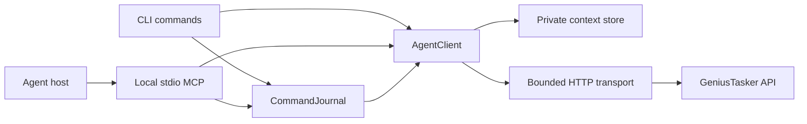
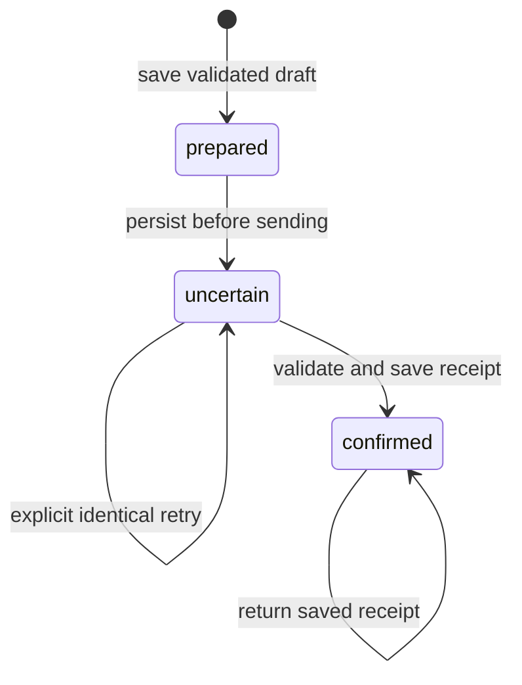

# Client architecture

The CLI and MCP server share one delegated client. The client communicates with
the GeniusTasker service; it does not execute an agent's external workflow.
Projects and account memories are independent resources with explicit grants.

## Module responsibilities

| Module                | Responsibility                                                              |
| --------------------- | --------------------------------------------------------------------------- |
| `cli.mjs`             | Argument validation, context/environment selection, output and exit status  |
| `login.mjs`           | Browser PKCE consent, loopback callback validation and optional device flow |
| `store.mjs`           | Private local files, atomic replacement and inter-process locking           |
| `client.mjs`          | Origin-bound sessions, serialized renewal, profile selection and reads      |
| `transport.mjs`       | Allowed origins/routes, timeouts, size limits and sanitized API failures    |
| `commands.mjs`        | Validated command envelopes and durable immutable operation journals        |
| `profiles.mjs`        | Bounded profile discovery, creation, restriction and selection              |
| `changes.mjs`         | Validated incremental reads and bounded, cancellable waits                  |
| `mcp.mjs`             | Strict tool schemas and protocol-safe responses over stdio                  |
| `errors.mjs`          | Stable errors, safe serialization and CLI exit codes                        |
| `command-catalog.mjs` | Generated public interface definitions and limits                           |

## Authentication and renewal

1. The user starts `auth login` outside the MCP process. Browser consent selects
   resources and permissions; the CLI receives a one-use code through a validated
   loopback callback and exchanges it using PKCE.
2. Credentials are validated against the expected origin and identity before being
   written. Local storage uses a dedicated context and restrictive permissions.
3. Before renewal, the client acquires the context lock and persists a
   `refreshPending` marker. Concurrent processes cannot renew the same credential
   family simultaneously.
4. A successful, validated response replaces both tokens atomically. An uncertain
   response leaves the marker intact and requires reconnecting. It must not replay
   a possibly consumed refresh token.
5. Logout revokes the server session before deleting local credentials. A failed
   revoke retains the local state for recovery.

Separate contexts give terminals independent consented sessions. Sharing a context
shares its identity and locks. Profile selection can narrow access; it cannot
restore a broader grant or extend the server's absolute session lifetime.

## Writes and recovery

A domain command carries its scope, epoch, current revision, operation ID and
issue time. `prepare` validates and saves the complete request locally without
performing a domain write. The journal binds it to an origin, connection, profile
and session.

A timeout or malformed receipt does not establish whether the server committed.
The operation stays uncertain. The caller can retry the same saved request; it
cannot replace the body under the same ID or replay it after an identity change.
A conflict requires a fresh read and a new operation. The journal never stores
authentication tokens.

Profile changes use a separate lifecycle: creation keeps the caller's UUID,
restriction uses a current revision, and selection rotates credentials while
holding the context lock. They are not domain-journal operations.

## Reads and change cursors

Resource reads are bounded and permission-filtered. Callers preserve inventory
epoch/checkpoint fields while paging and follow continuation even when a page is
empty. A cursor does not grant access. Change pages validate scope, collection,
revision and shape before advancing saved state.

`watch` performs one bounded wait. It honors the server's polling interval and
cancellation; quota errors, expired history and revocation stop the wait. There is
no background subscription daemon or automatic monthly-limit retry loop.

## Transport and extension points

Requests are confined to delegated API routes and approved origins. Redirects
are refused. Requests and responses are size-bounded; raw network exceptions
never become user-facing diagnostic text. CLI stdout and MCP stdout stay free of
logging and browser-authentication prompts.

Add a public capability by updating its generated contract, boundary validation,
client operation, CLI/MCP adapter, failure tests and user documentation together.
Prefer existing transport and storage primitives. A future remote MCP adapter is
a separate integration described in [OpenAI integration](OPENAI.md); the current
local plugin manifest must not imply that endpoint already exists.

## Focused knowledge reads

`knowledge.mjs` validates bounded search, Graph neighborhood and reference inputs
for both CLI and MCP. It checks response scope/shape, never follows cursors
automatically and never persists linked Memory content. `truncated` is an explicit
partial graph, not evidence that omitted nodes or relations do not exist. Target
permissions remain server-owned and independent of access to the referring graph.

## Conditional resource cache

`read-cache.mjs` keeps at most 64 responses and 8 MiB in process memory, with
15-minute idle eviction. Exact query keys include a hashed origin/credential
realm. Every hit makes an authenticated conditional request; no cache entry can
bypass current server permissions, quotas or source versions. Servers without
validators remain compatible and receive ordinary reads.

Concurrent identical reads share one request. Generation fences prevent late
responses from repopulating a cache after account/profile changes, failures or
MCP writes. Failed validation clears cached private bodies; there is no stale
success fallback and no persistent resource cache. Returned values are cloned so
one tool call cannot mutate another caller's cached result.

## Explicit repository snapshots

`documentation.mjs` validates the bounded tree and Markdown APIs. The sync
orchestrator keeps the selection independent of projects, compares descendant
versions, retrieves changed documents, verifies media and rechecks source
contexts before commit. `documentation-graph.mjs` maintains qualified Graph
records through incremental cursors and portable chunks of at most 100 records.
References do not materialize another Memory's private source bodies.

`documentation-store.mjs` owns only the configured destination's `content/`
subdirectory. A manifest records hashes and provenance. Local edits, unknown
files, symlinks and account/environment mismatches fail explicitly. A process
lock, staged tree and rename journal protect concurrent or interrupted exports.
Network failures leave the previous dated snapshot; current authorization is
never inferred from a local file. Confirmed scope revocation removes managed
source content at the next successful check, but cannot retract Git history or
copies elsewhere. The explicit export is separate from the process read cache.
